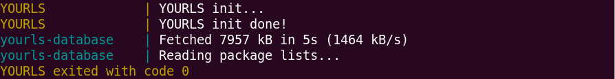
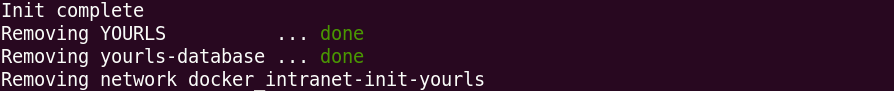

## - Prerequisite
* Assuming you already have [Docker](https://docs.docker.com/install/) and [Docker Compose](https://docs.docker.com/compose/install/) installed

## - YOURLS Environment
#### Using official docker images:
1. [`yourls:1.7.4-fpm-alpine`](https://hub.docker.com/_/yourls?tab=tags&page=1&name=1.7.4-fpm-alpine)
2. [`mysql:8.0.18`](https://hub.docker.com/_/mysql?tab=tags&page=1&name=8.0.18)
3. [`nginx:1.17.5-alpine`](https://hub.docker.com/_/nginx?tab=tags&page=1&name=1.17.5-alpine)

## - HOW-TO
#### 0. Change your database user and password in [`env-mysql.env`](/docker/deploy/env-mysql.env#L5-L7) and [`env-yourls.env`](/docker/deploy/env-yourls.env#L8-L10)
#### 1. Run script `0-init.sh` to initialize database for YOURLS
* You should see following 3 kinds of success log
    1. YOURLS init
        ```bash
        YOURLS             | YOURLS init...
        YOURLS             | YOURLS init done!
        YOURLS exited with code 0
        ```
        
    2. MySQL init
        ```bash
        yourls-database    | update db user privileges
        yourls-database    | MySQL init done!
        yourls-database exited with code 0
        ```
        
    3. Finish and shutdown
        ```bash
        Init complete
        Removing YOURLS          ... done
        Removing yourls-database ... done
        Removing network docker_intranet-init-yourls
        ```
        
* If things failed, try to increase delay time ([POSTPONE_FOR_A_WHILE=60s](/docker/docker-compose-init.yml#L25))
    - E.g., set to `90s` or longer
    - Note that you have to [remove old failed](#3-shutdown-and-remove-data-using-script-2-downsh) database before retry
* Set flags in [`docker-compose-init.yml`](/docker/docker-compose-init.yml#L7-L8) as needed
    - Set `INIT_INSTALL_RECOMMENDED_PLUGINS=true` to install [plugins](/docker/init/recommended_plugins) recommended (and revise) by me
    - Set `INIT_ENABLE_GITLAB_OAUTH_SUPPORT=true` to add [(GitLab) OAuth support](https://github.com/LouisSung/YOURLS-OAuth_Sign_In)
#### 2. Run script `1-run.sh` to start your YOURLS service
* Now, you can visit [`http://localhost/admin/index.php`](http://localhost/admin/index.php) to start using YOURLS
* Remember to change ***domain*** setting in both [Nginx config](/docker/deploy/default.conf#L5) and [YOURLS](/docker/deploy/env-yourls.env#L5)
    + Note that `config-docker.php` will be copied as `/docker/deploy/yourls/user/config.php`, so change that file after running `0-init.sh` rather than modify `config-docker.php` itself
    + Also remember to replace [default user](/docker/init/config-docker.php#L61) as your own ones; otherwise, it may be dangerous
#### 3. Shutdown (and remove data) using script `2-down.sh`
* Answer `Y` to `Warning!! (Permanently) REMOVE folders for yourls and database? [y/N]` if you want to **Remove Database and YOURLS**
    + This is for removing files when the `0-init.sh` script failed
    + 
* Otherwise, answer `N` or `Press Enter` to keep data

## - Concept
* The main point is that MySQL chane their policy on authentication method
    + The critical script is [`cmd-mysql.sh`](/docker/init/cmd-mysql.sh) for this project
        - [`#L15`](/docker/init/cmd-mysql.sh#L15) is the original entrypoint, which will initialize the database
        - [`#L16`](/docker/init/cmd-mysql.sh#L16) is for command `ps` and `pkill` in alpine
        - [`#L17`](/docker/init/cmd-mysql.sh#L17) is the [delay time](/docker/docker-compose-init.yml#L25) for former works to get ready
        - [`#L18`](/docker/init/cmd-mysql.sh#L18) is to kill the original *mysqld*
        - [`#L20`](/docker/init/cmd-mysql.sh#L20) is to create a new `mysqld_safe` with flag `--skip-grant-tables`
        - [`#L26-L29`](/docker/init/cmd-mysql.sh#L26-L29) are to enable `mysql_native_password` for user

## - License
This project is licensed under the following 3 licenses, YOURLS, MIT, and EPL
1. YOURLS: aka `Do whatever the hell you want with it`
2. MIT: aka `MadeInTaiwan Licence` ฅ• ω •ฅ
3. EPL: aka `EPL Public License`, where EPL stands for *EmbeddedPlatformLab* (like GNU or YAML, quite cool, huh?)

Feel free to modify it to your own version as needed  
Contact me if having any comments :D
